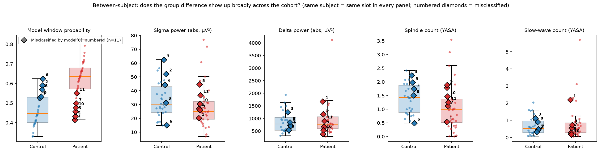
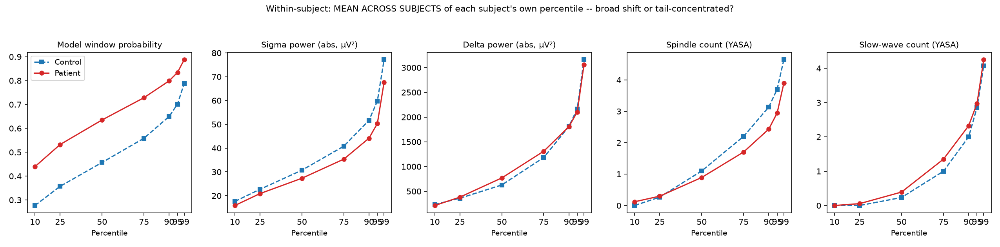
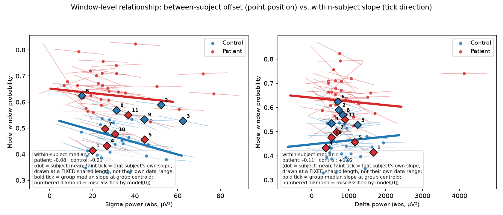

# Does the Model's Clinical Prediction Rest on Real Signal? A Causal Investigation of Sigma-Band Power

## Executive Summary

**The question.** Does the model's patient/control prediction rest on genuine physiological signal,
or could it be a confound/artifact that happens to correlate with the label?

**The headline answer: yes, it's real.** The model has learned to treat elevated sigma-band
(spindle-range, ~12–16 Hz) power as evidence against the patient class. This is established four
independent ways: a consistent within-subject correlation between sigma power and predicted
probability (median r ≈ −0.13 to −0.14); a direct causal effect confirmed by perturbing sigma power
and observing a dose-proportional, consistent response (94.6% of subjects move in the predicted
direction, R² ≈ 0.97); agreement from an independent, waveform-based spindle detector (YASA) that
never saw the spectral-power pipeline; and a raw, model-free replication of the sleep-spindle-deficit
literature directly in this cohort's own data (patients show significantly lower spindle counts,
p ≈ 0.003–0.005), with no model involved at all. This is causal evidence, not just correlational, and
it converges across every measurement approach tried.

**What was tried to improve on the p85 baseline, and what's recommended.** Two learned-aggregation
alternatives were built and fully characterized: **Option A** (attention over a frozen, already-
validated per-window probe) and **Option B** (attention over raw embeddings, no separate probe). Both
beat the p85 baseline by the same margin (test AUC 0.918 vs. 0.882) and preserve the sigma mechanism
(Option A: 100% directional consistency, R² = 0.993; Option B: 97%, R² = 0.930), but only Option A's
internal mechanism is actually interpretable — its attention gate learns a separate, explicable
content preference, while Option B's internals are functionally necessary but not individually
meaningful. **Option A is recommended.** A third approach, **Option C** (training a window-level
probe under the more realistic standard-MI assumption instead of the naive collective one), **failed**:
it reversed the sigma relationship entirely (`frac(slope>0) = 1.00`, R² = 0.958) due to a
self-reinforcing selection loop — a distinct, previously underweighted MIL failure mode, kept in this
document as a methodological lesson for any future multiple-instance-learning work.

**The labeling-scheme question is closed, with a negative result.** The long pursuit of a "more
physically grounded" window-labeling scheme (Option C, then a proposed pseudo-labeling fix) assumed
patients have a normal baseline plus a discoverable minority of symptomatic windows. The data refutes
this: the group difference is diffuse and broad, present through the bulk of a typical subject's own
recording, not concentrated in a tail — consistent with the sleep-spindle deficit being a *trait*
marker (persistent) rather than a *state* marker (episodic), exactly as the literature already
describes it. Conclusion: stop pursuing instance-selection schemes for this problem; future
refinement should focus on denoising/averaging a per-window signal that is genuinely diffuse, not on
finding "the right windows."

**Concrete validation down to individual errors.** The sigma mechanism explains most of the model's
specific misclassifications, not just its aggregate accuracy: 5 of 6 misclassified patients (false
negatives) have unusually high, control-like sigma/spindle values; on the control side the picture is
a genuine, honestly-reported asymmetry — only 1 of 5 misclassified controls mirrors the pattern in
reverse, with the other 4 unexplained by sigma.

**Open items, not yet resolved:**
- Antipsychotic medication as a confound — plausible, especially for the raw-data delta/slow-wave
  surprise, but untestable without medication metadata.
- One misclassified patient (GRINS0001) and four misclassified controls have no identified
  explanation.
- The pseudo-labeling design (how to threshold/weight pseudo-labels by subject-level confidence) was
  motivated but never built, once the labeling-scheme thread closed.
- A CLI/checkpoint-loading consolidation refactor across the `p08b`/`p09`/`p13`–`p23` script family is
  deferred, tracked separately.

**Where to look for detail**, if a claim above needs the derivation: the sigma mechanism is Chapters
2–4; the architecture comparison (p85/Option A/B) is Chapters 6–8; Option C's failure is Chapter 9;
the labeling-scheme closure is Chapters 10–11; the misclassification case study and figures are
Chapters 12–13; data-cleaning and pipeline rationale are Appendices A–B.

---

## 1. Motivation

CBraMod-based probing on our EEG cohort produces a subject-level clinical prediction (patient vs.
control) by pooling window-level probabilities (85th percentile of the window scores across a
subject's recording). Correlational analyses had repeatedly flagged the sigma band (~12-16 Hz,
spindle range) as behaving differently from the other canonical bands: it was the one band whose
relative power didn't fall into the mutually-reinforcing delta/theta/alpha cluster, and it showed
a distinct relationship with predicted probability once the underlying signal pipeline was fixed
(see Background). But correlation alone can't tell us whether the model is actually *using* sigma
power as evidence, or whether sigma power is merely a marker of some other confound (subject
identity, recording quality, an artifact of relative/compositional band power, etc.) that happens
to move together with the prediction. The goal of this investigation was to walk back from the
subject-level decision to a causal claim: does deliberately perturbing sigma power, and nothing
else, change what the model predicts — and does that effect survive at the level pooling actually
operates at (a whole subject's recording), not just at the level of an individual window?

## 2. Technical Background

**Pipeline.** Each window's raw EEG passes through the CBraMod backbone, is pooled across channels
(channel-mean), and z-scored per-window-per-channel before featurization. A window-level
probability is produced per window, and a subject-level decision is produced by taking a fixed
percentile (p85) of all the subject's window scores.

**Two confounds fixed before this investigation could be trusted.** First, a referencing bug meant
100% of subjects were silently falling back to Common Average Reference (CAR) instead of the
intended linked-earlobe (A1/A2) reference, because A1/A2 channels were being dropped from the pick
list before the referencing step ever looked for them. CAR referencing over near-uniform cortical
signal tends to cancel out real amplitude differences, producing artificially uniform, low-variance
channel-mean signals — this was silently degrading every absolute-power and YASA-based
(spindle/slow-wave detection) analysis run before the fix. Second, *relative* (ratio) band power is
compositionally constrained — five bands summing to ~1 mechanically forces anti-correlation with
whichever band dominates, independent of any real physiology. Absolute power, computed on the
properly-referenced signal, avoids this closure artifact and is what all analyses below use.

**Why percentile pooling complicates causal reasoning.** Pooling via percentile is a nonlinear,
whole-distribution-dependent statistic, not a linear average. Leave-one-out analysis showed that,
holding a subject's window scores fixed, only windows immediately adjacent to the 85th-percentile
rank have any marginal influence on the pooled score — most windows have zero leave-one-out
contribution. This means "which windows matter" is not a fixed, perturbation-invariant property
that can be read off the baseline distribution; it was tempting, but wrong, to reason from
"baseline-influential windows" about what a broader perturbation would do.

## 3. Investigation

**Real (absolute) band-power correlation structure.** Before the referencing fix, every pairwise
correlation among the five canonical bands' absolute power was ~0.98-0.99, pooled or
within-subject — a spuriously uniform "one latent factor" pattern that was itself a symptom of the
near-degenerate, CAR-cancelled channel-mean signal, not real physiology. After the fix, the
structure differentiated substantially and became physiologically coherent: delta, theta, and alpha
form a positively-correlated cluster (within-subject median r ranging +0.33 to +0.62 across
validation/test for the delta-theta/delta-alpha/theta-alpha pairs), delta and beta trade off
(within-subject median r = -0.38 on validation, -0.46 on test), and — most relevant to the sigma
story — **delta and sigma are essentially decoupled** (within-subject median r = -0.03 on
validation, -0.005 on test). That decoupling matters directly for the causal argument: delta power
itself correlates only weakly and inconsistently with predicted probability (within-subject median
r = -0.11 on validation, -0.03 on test), so sigma's own correlation with probability — which, unlike
the pooled number (r = -0.011 on validation vs. -0.240 on test, an example of the pooled/
within-subject divergence flagged in Background), is *consistent* at the within-subject level
(median r = -0.13 on validation, -0.14 on test) — can't be explained as sigma merely echoing a
larger delta/slow-wave-power confound. Sigma's relationship with the model's output looks like an
independent effect, not a secondary consequence of dominant slow-wave power.

**Corroborating evidence from an independent detector (YASA).** Before moving to intervention,
relative band power's sigma-specific signal was cross-checked against a completely different
measurement approach: YASA's validated spindle (`spindles_detect`) and slow-wave (`sw_detect`)
event detectors run on the properly-referenced signal, correlating event *counts* per window
against predicted probability. If sigma power's relationship with probability were a spectral
artifact rather than something tied to real spindle activity, an independent, waveform-based event
detector would have no reason to agree with it. It did: spindle count correlated negatively with
probability consistently across both validation and test sets, both pooled and within-subject
(validation: pooled r = -0.123 n=6800, within-subject mean r = -0.060/median r = -0.037, n=34
subjects; test: pooled r = -0.157 n=7354, within-subject mean r = -0.061/median r = -0.031, n=36
subjects) — the same sign, at a comparable magnitude, as sigma relative power's own within-subject
correlation (median r ≈ -0.10 to -0.16 across the two sets). Slow-wave count showed no such
agreement: correlations were small and inconsistent in sign across the two sets (pooled r = +0.058
on validation vs. -0.037 on test; within-subject mean r ≈ +0.01 on both), i.e. essentially null. This
asymmetry — spindles (sigma-band events) converging with the sigma story, slow waves (delta-band
events) not converging with anything — is itself informative: it argues the sigma finding tracks
something real and specific to spindle-band activity, rather than being a generic artifact that
would be expected to show up equally in any morphological event count.

**Window-level causal test.** For sampled windows, sigma-band power was scaled by a controlled
factor (0.5x-1.5x) via bandpass filtering, with total signal energy preserved to keep the perturbed
window inside the model's training distribution (avoiding a "went out of distribution" confound).
This established that scaling sigma power up moves individual window-level probabilities down in a
consistent, dose-proportional way — a direct causal effect, not just a correlation.

**Subject-level causal test (does pooling preserve or destroy this effect?).** The window-level
result doesn't guarantee anything at the subject level, since p85 pooling could in principle be
insensitive to a change that doesn't land near the percentile rank. Perturbing *all* windows of a
subject and re-pooling showed 95% of subjects moved in the same (negative) direction, with a strong
linear fit (R² ≈ 0.97) between pooled score and scale factor, and a "propagation ratio" (pooled-score
shift ÷ naive-mean-of-window-scores shift) with a median near 0.93 — meaning percentile pooling
transmits about as much of the window-level effect as plain averaging would, i.e. pooling is not
silently discarding the signal.

**The dose-response sharpening.** Perturbing *all* windows doesn't distinguish a genuine
propagating effect from a mechanical artifact of moving essentially the entire recording at once.
To sharpen this, perturbation was applied to a graded, nested sequence of random subsets (25%, 50%,
75%, 100% of a subject's windows, each a strict superset of the smaller fraction, so the swept
variable is cleanly "how much of the recording changed"). An earlier attempt to explain results via
"did perturbation hit the baseline-influential windows" was abandoned once it became clear that
percentile pooling's dependence on the whole sorted distribution means "influential windows" isn't
a fixed, perturbation-invariant concept — a window with zero baseline influence can still end up
determining the percentile once the distribution shifts.

## 4. Key Results

- **Sigma is decoupled from delta, so it isn't a slow-wave-power echo**: on properly-referenced
  data, absolute delta and sigma power are essentially uncorrelated within-subject (median r ≈ -0.03
  to -0.005 across validation/test), while delta co-moves with theta/alpha (median r up to +0.62)
  and trades off against beta (median r ≈ -0.4). Since delta itself only weakly and inconsistently
  predicts probability, sigma's own consistent within-subject correlation with probability (median
  r ≈ -0.13 to -0.14 on both sets) looks like an independent signal, not something riding along with
  a larger slow-wave confound.
- **Independent corroboration, and a telling asymmetry**: YASA-detected spindle count (a
  waveform-based detector, not a spectral-power measurement) correlates negatively with predicted
  probability on both validation and test sets, pooled and within-subject, converging with the
  sigma relative-power finding — while slow-wave count shows no such consistency (sign flips
  between validation and test, near-zero within-subject). Two independent measurement methods
  agreeing specifically on sigma/spindles, and specifically failing to agree on delta/slow-waves,
  argues the sigma finding is tracking something real rather than a generic artifact of either
  measurement approach.
- **Direction and reliability**: increasing sigma power reliably decreases the subject-level
  predicted probability in 35/37 subjects (94.6%), and this fraction is *bit-for-bit identical* at
  every perturbation dose tested (25/50/75/100%) — the same two subjects buck the trend
  consistently, arguing this is a real per-subject exception, not sampling noise.
- **Dose-response confirms a real, non-artifactual effect**: raw effect size (subject-level slope)
  scales down almost exactly proportionally with the perturbed fraction (-0.0551 at 100% →
  -0.0135 at 25%, a ~4x change tracking a 4x change in fraction), consistent with a model where
  sigma power's effect is roughly uniform across a subject's windows and perturbing a random subset
  translates the whole score distribution by a proportionally diluted amount.
- **Pooling efficiency is dose-invariant**: the propagation ratio's median stays essentially flat
  (0.91-0.94) across the entire 25%-100% range (Spearman ≈ +0.08, i.e. no meaningful trend) — the
  *fraction* of window-level signal that reaches the subject-level decision doesn't degrade as less
  of the recording is perturbed. (The mean of this ratio is noisier — a few subjects with a small
  but nonzero denominator produce outsized ratios — the median is the reliable summary.)
- **Resolving an apparent contradiction**: this dose-invariant propagation is compatible with the
  earlier finding that most windows have zero baseline leave-one-out influence, because under a
  continuously shifting distribution, a *different* window keeps occupying the percentile rank at
  each step, each reflecting the same aggregate shift — no single window has to carry the whole
  effect for the percentile to track a distributional shift about as faithfully as the mean does.

**Bottom line**: this is genuine causal evidence, not merely correlational, that the model has
learned to treat elevated sigma-band power as evidence against the patient class, that this
relationship is not an artifact of the specific "perturb everything at once" setup, and that
percentile pooling does not silently discard this signal on its way from window-level to
subject-level decisions.

## 5. Next Steps

With the causal chain from band-level perturbation to subject-level decision now established and
validated, the natural next question is whether a *learned* aggregation over windows would do
better than the fixed p85 heuristic — motivating a move to attention-based multiple-instance
learning (MIL), in two candidate forms:

- **Option A**: attention over frozen window-level probabilities (backbone stays frozen; only the
  aggregation step becomes learned instead of a fixed percentile).
- **Option B**: attention over frozen window-level embeddings, with the aggregation itself learning
  which windows to weight, rather than assuming a fixed percentile rank is always the right summary
  statistic.

Both keep the backbone frozen to isolate the effect of aggregation choice; the open design question
is how much capacity/data is warranted per option before this stops being a lightweight follow-up to
the frozen-backbone probing line of work.

---

## 6. Attention-MIL Follow-Up: Architecture, Performance, and Interpretability

Section 5 proposed replacing the fixed p85-percentile pooling rule with a learned aggregation.
This chapter covers the first implementation (Option A), what it changed relative to the p85
baseline, and — more importantly — a full interpretability investigation of *what the learned
aggregation actually does*, since a model that pools differently but for reasons unrelated to real
signal would be a regression, not an improvement.

### 6.1 Architecture

The implementation (`p13_attention_mil_pooling.py`) is a deliberate hybrid, closer to pure Option A
than Option B, and it's worth being precise about exactly where it sits:

- **Unchanged from the original pipeline**: the CBraMod backbone (frozen) and the window-level probe
  head (`p08b`-trained linear head, frozen, never retrained). Each window still produces a scalar
  probability exactly as before.
- **New**: an `AttentionPoolingHead` — a small gate (`LayerNorm → Linear(6000→64) → Tanh → Dropout →
  Linear(64→1)`) applied independently to every window's frozen embedding, producing one
  unnormalized score per window. Softmax-normalizing these scores over a subject's whole window set
  gives a set of attention weights (summing to 1) with no dependence on how many windows that subject
  has — the gate's parameters are shared across windows regardless of bag size, and softmax
  normalizes over whatever length it's given at call time. The subject-level score is
  `Σ attn_weight_i × window_prob_i` — the *quantity pooled* is still the probe's own scalar output
  (pure Option A), but the *gate's input* is the full frozen embedding, not just that scalar (a
  deliberate departure toward Option B's expressiveness, made because a 1-dimensional gate input
  would only be able to learn a monotonic reweighting of the probe's own score — collapsing into "yet
  another fixed pooling statistic" rather than genuine contextual attention).
- **Training**: subjects are processed one bag at a time (no padding/masking needed for variable
  bag sizes), with gradient accumulation over `--subjects-per-step` subjects before each optimizer
  step. Checkpoint selection reuses the same strict-Pareto (+large-gain/small-dip exception) F1/AUC
  criterion as the rest of the pipeline. Both the probe and attention-head checkpoints now save
  their own architecture metadata (`head_type`/`head_dim`/`attn_hidden_dim`/etc.) rather than relying
  on CLI flags to happen to match what was actually trained — a footgun caught and fixed twice during
  this work.

### 6.2 Performance vs. the p85 baseline

On a full-cohort run (154 train / 32 val / 35 test subjects), attention pooling beat p85 by a
consistent, replicating margin:

| | Validation (best checkpoint) | Held-out test (same, val-selected threshold) |
|---|---|---|
| Attention AUC | 0.980 | 0.918 |
| p85 AUC | 0.944 | 0.882 |
| **Gap** | **+0.036** | **+0.036** |

The identical gap at val and test is the important part — it's not a validation-set artifact. F1 is
noisier at this cohort size (a 99-way threshold sweep over a few dozen subjects is a high-variance
statistic, per `is_checkpoint_improvement()`'s own rationale) and dropped from val to test for *both*
methods, a normal generalization gap rather than something specific to attention. Training also
showed a real overfitting shape — validation AUC peaked around epoch 8–10 then drifted down while
train loss kept falling — consistent with a ~384K-parameter gate (`num_patches × emb_dim × hidden_dim`
≈ 6000×64) being fit against only 154 subject-level labels; a capacity/data-size tension worth
keeping in mind rather than assuming the current hyperparameters are optimal.

### 6.3 Interpretability: what did the gate actually learn?

The natural next question — does the learned gate rely on real signal, and does it relate to the
sigma-band mechanism from Chapters 3–4 — turned out to have a more interesting answer than "yes, it
rediscovered sigma."

**The dominant signal is delta, not sigma**, and it's strong and essentially universal:

| Feature | Within-subject median r vs. `attn_weight` | Consistency |
|---|---|---|
| Delta power | **-0.81** | 100% of subjects < -0.2 |
| Slow-wave count | -0.44 | 94% of subjects < -0.2 |
| Beta power | +0.52 | 91% of subjects > 0.2 |
| Theta power | -0.40 | 86% of subjects < -0.2 |
| Spindle count | +0.36 | 74% of subjects > 0.2 |
| Sigma power | +0.15 | split 40%/11%, no clear majority |

Sigma — the band the causal perturbation chapter validated as the reliable driver of *predicted
probability* — is only weakly and inconsistently related to the gate's own weighting. This isn't a
contradiction (see 6.5); it's a clue that the gate learned something orthogonal to the sigma
mechanism, not a restatement of it.

**A large categorical bias on top of the delta effect**: N2 windows receive roughly 25× the average
per-window attention weight that N3 windows do (mean 0.0025 vs. 0.0001) — despite being only 2.5×
more numerous (71% vs. 29% of windows). In aggregate, N2 gets ≈98.5% of total attention mass; N3
gets ≈1.5%. Stratifying by stage confirmed the delta relationship is *not* just this categorical bias
in disguise — it persists strongly within N2 alone (median r = -0.68) and within N3 alone (median r
= -0.47), just at different magnitudes.

**A Simpson's-paradox-style finding, stage-specific sigma sensitivity**: pooled across both stages,
sigma looked weak and inconsistent (median r ≈ +0.15). Stratified by stage, a real signal emerged
specifically within N3: sigma correlates much more strongly and consistently there (median r = +0.34,
74% of subjects > 0.2), as does alpha (median r = +0.30, 66% > 0.2) — a relationship the pooled
number was diluting, not one that didn't exist.

**Two confounds tested and ruled out** as explanations for the strong delta effect:
- *Informativeness filtering* (does the gate just downweight windows where the frozen probe's own
  prediction is near-0.5/uninformative?): real but small — `attn_weight` vs. prediction "extremity"
  showed median r = +0.19, and extremity vs. delta showed median r = -0.17 — both far too small to
  account for the -0.68/-0.81 direct effect.
- *Time-of-night* (delta is known to decline across the night — could the gate simply favor later
  windows for an unrelated reason?): a partial correlation controlling for window position
  (`raw_epoch_index`) barely moved the direct effect (pooled -0.727 vs. raw -0.750; within-subject
  median -0.762 vs. raw -0.805) — confirming the delta relationship is direct, not mediated by time.

**Physiological grounding**: this cohort's clinical condition is schizophrenia, which changes how to
read the sigma-band causal finding specifically. Reduced sleep spindle density is one of the most
robustly replicated EEG findings in schizophrenia (Ferrarelli, Tononi; Manoach, Stickgold, and
others), observed even in unaffected first-degree relatives, and linked to thalamocortical circuit
dysfunction — proposed as a genuine illness endophenotype, not just a corollary. The causal result
that more sigma-band (spindle-range) power pushes the prediction toward "control" lines up directly
with that literature. Delta/SWA findings in schizophrenia are less uniformly replicated but have
support too (the synaptic homeostasis hypothesis links reduced SWA to reduced cortical synaptic
density). The most important **unresolved confound**, specific to this diagnosis, is antipsychotic
medication — independently well-documented to alter both SWA and spindle density — which could not
be tested here since medication status wasn't available in the subject metadata.

### 6.4 Does the causal mechanism survive under attention pooling?

The interpretability findings raised a sharp follow-up question: since the final score is
`Σ attn_weight_i × window_prob_i`, and the validated sigma-causal effect lives in `window_prob`
(produced by the untouched, frozen probe), does that effect actually need to also show up in
`attn_weight` to reach the final decision — or could the gate be doing something else entirely
without breaking the causal chain? Correlational analysis of `attn_weight` alone can't answer this;
it only tests whether the gate *itself* tracks a band, not whether that band's effect *reaches the
final score*.

This was tested directly (`p15_attention_pooled_perturbation_test.py`): perturb sigma power on the
raw waveform (identical mechanics to Chapter 3's causal test), and compare how much of that effect
reaches the p85-pooled score vs. the attention-pooled score, computed from the *identical* perturbed
window-level probabilities at every step.

| | p85 | Attention |
|---|---|---|
| frac(slope < 0) | 1.00 | 1.00 |
| mean slope | -0.060 | -0.117 |
| mean propagation_ratio | 1.16 | 2.70 |
| median propagation_ratio | 0.99 | 1.92 |

Every subject shows the same directional response under both pooling methods — perfect agreement.
But attention pooling doesn't just preserve the causal effect, it **amplifies** it: roughly double
the raw slope, and a propagation ratio well above 1 (vs. p85's near-1.0), meaning the attention-pooled
score moves *more* than a naive average of window-level shifts would predict. The paired comparison
confirms this isn't a fluke of aggregate statistics: attention's propagation ratio exceeds p85's in
94% of (subject, fraction) rows.

**The mechanistic explanation ties directly back to 6.3**: the gate concentrates the overwhelming
majority of its attention on N2 windows — plausibly the windows where sigma-band manipulation has the
most room to affect `window_prob` (lighter sleep, active spindle generation), versus N3 windows where
a deep, delta-saturated signal may leave less headroom for a sigma perturbation to move the
prediction. An aggregation that concentrates weight on exactly the windows where the causal signal is
clearest will naturally show a stronger aggregate response than a percentile statistic that doesn't
discriminate this way.

### 6.5 Synthesis: division of labor between probe and gate

Putting 6.3 and 6.4 together gives a clean picture of how this specific architecture splits the work:

- **The frozen probe head** carries the validated sigma/spindle causal signal — established in
  Chapters 3–4 and structurally unchanged here, since the probe is never retrained.
- **The attention gate** learned something largely orthogonal: a stage/content-informativeness axis
  favoring N2, delta-light, spindle/beta-rich windows over N3, delta-heavy ones — not a re-encoding of
  the sigma signal itself.
- **These compose constructively, not by coincidence**: the gate's learned preference happens to
  concentrate pooling weight on the windows where the probe's sigma-sensitivity is (plausibly)
  strongest, so the causal effect doesn't just survive the new pooling rule — it's amplified by it.

This "division of labor" is a property of *this* hybrid design specifically — a frozen probe
producing an already-informative scalar, with a separately-learned gate reweighting those scalars.
It is an explicit, testable prediction (not yet checked) that this division might not hold under
Option B, where there is no separate frozen scalar channel for a causal signal to live in — the
attention mechanism there would have to learn everything about *both* what a window says and how much
to trust it, jointly, from the raw embedding alone.

---

## 7. Option B: Gated Attention Over Embeddings — What It Learned, and What It Didn't

Option B (`p16_gated_attention_embedding_mil.py`) removes the frozen probe entirely: gated attention
(Ilse, Tomczak & Welling, 2018 — a tanh branch elementwise-gated by a sigmoid branch, more expressive
than Option A's single-nonlinearity gate) operates directly on frozen CBraMod embeddings, and a
freshly-trained head maps the resulting pooled representation to the subject-level prediction. There
is no per-window probability anywhere in this pipeline — everything is learned jointly from
subject-level labels alone. This chapter covers what that bought (and cost) relative to Option A, and
a genuinely important epistemological correction that emerged partway through interpreting it.

### 7.1 Architecture and head-type choice

Two head variants were tried, `mlp` (default, 2-layer) and `linear` (1-layer):

| | Parameters | Val F1 / AUC | Test F1 / AUC | Val→test AUC gap |
|---|---|---|---|---|
| MLP head | ~780K | 0.873 / 0.917 | 0.825 / 0.852 | **-0.065** |
| Linear head | ~408K | 0.905 / 0.929 | 0.853 / 0.918 | **-0.011** |

The linear head won decisively on every axis — higher validation and test performance, and roughly
6× smaller generalization gap — not merely a capacity-vs-interpretability tradeoff but a real,
practical improvement in this small-cohort regime. It's also exactly decomposable: because
`pooled = Σ attn_weight_i · embedding_i` and a linear head distributes over that sum,
`head(pooled) = Σ attn_weight_i · head(embedding_i)` **exactly** — verified numerically to
float-precision on both synthetic data (~1e-16 error) and the real trained model (~4.77e-07 error,
consistent with float32 rounding). This gives a genuine per-window "evidence" term, unlike Option A's
`window_prob` (inherited from a separately-trained probe) or any of the approximate proxies used
earlier in this investigation. An MLP head breaks this property entirely (nonlinear functions don't
commute with a weighted sum), so all interpretability work in this chapter is specific to the linear
head. All results below use it.

Linear head's test AUC (0.918) is an exact match to Option A's (0.918) — both also beating the
original p85 baseline (0.882) by the identical +0.036 margin. Plausible coincidence rather than a
deep result: AUC on 35 subjects is a coarse statistic, and both models share the same frozen backbone
underneath.

### 7.2 Interpretability: a weaker echo, and a striking internal anti-correlation

Correlating the gate's `attn_weight` against band power (same methodology as Chapter 6.3) showed the
**same-signed** content preference as Option A (delta/theta/slow-waves down, beta/spindles up), but
roughly a third to a half the magnitude and far less universal (delta's `frac(r<-0.2)` dropped from
100% in Option A to 46% here; beta's `frac(r>0.2)` dropped from 91% to 34%). That two independently
trained, architecturally different models converge on the same qualitative preference is a point in
favor of that content axis being a real, robust regularity — just a much weaker signal without a
frozen probe to lean on.

A second per-window quantity — `window_evidence = head(embedding_i)`, the exact per-window
contribution the linear head makes before pooling — correlates against band power with **nearly
mirror-image signs** of `attn_weight`'s own correlations (e.g. delta +0.13 vs. attn_weight's -0.20).
Directly testing this: `attn_weight` vs. `window_evidence` shows a strong, essentially universal
**negative** correlation (within-subject median r = -0.49, 100% of 35 subjects < -0.2) — the gate
systematically downweights exactly the windows that, scored in isolation, look most patient-like, and
upweights the windows that look most control-like, for nearly every subject regardless of their true
label.

### 7.3 A necessary epistemological correction

Before ablating this pattern, a sharp objection was raised and is worth recording precisely: `attn_weight`
and `window_evidence` are two jointly-optimized components of one machine trained to produce a good
*aggregate* subject-level prediction. Nothing in that training objective requires either component to
carry an independently sensible meaning — the network is only ever evaluated on the sum, never on the
individual terms (the exact-decomposition property in 7.1 is a fact about *how the final number is
computed*, verified by direct computation; it does not by itself establish that either term is
semantically meaningful in isolation). Two components can develop a jointly-compensating relationship
that "gets the job done" together while being individually arbitrary — a well-recognized risk in
interpreting any jointly-trained intermediate representation (attention weights in particular have a
literature specifically warning against over-interpreting them, e.g. "Attention is not Explanation").
The strong anti-correlation in 7.2 is exactly consistent with either story — a semantically meaningful
one (the gate distrusts noisy extreme evidence) or a functionally arbitrary but jointly load-bearing
one — and correlating against band power cannot distinguish them.

### 7.4 Does the specific pairing matter functionally? (permutation test)

A first ablation design — averaging many within-subject random shuffles of `window_evidence` into one
score per subject, then comparing whole-cohort TRUE/UNIFORM/SHUFFLED metrics — was caught as
mathematically vacuous *before running it*: because `attn_weight` sums to 1 (softmax),
`E[Σ attn_weight_i · evidence_perm(i)] = mean(evidence)` **exactly**, for *any* pairing whatsoever.
Averaging many shuffles per subject therefore converges to the uniform baseline by linearity of
expectation alone, with zero dependence on whether the true pairing carries information — a tautology,
not a test.

The corrected design is a genuine permutation test: generate K independent whole-cohort "shuffled
worlds" (each subject gets its own random permutation of `window_evidence` in that world, `attn_weight`
untouched), compute one whole-cohort AUC/F1 per world, and compare the model's actual (TRUE)
performance against that empirical null distribution. Validated on synthetic cases before trusting it
(a constructed "pairing matters" case placed TRUE at the 100th percentile of the shuffled distribution;
a "pairing doesn't matter" case placed it at an unremarkable 74th).

Applied to the real model (300 shuffles, 35 test subjects):

| | F1 | AUC |
|---|---|---|
| TRUE (as trained) | 0.8528 | 0.9178 |
| UNIFORM weights | 0.7200 | 0.9112 |
| SHUFFLED null (mean ± std) | 0.7201 ± 0.0020 | 0.9094 ± 0.0033 |

TRUE beat every one of the 300 shuffles on both metrics (100th percentile) — in units of the null
distribution's own spread, ~66 standard deviations above the shuffled mean on F1, ~25 on AUC. The
specific learned pairing is genuinely, overwhelmingly load-bearing, not incidental. (A useful side
effect: UNIFORM and the shuffled mean match almost exactly — 0.7200 vs. 0.7201, 0.9112 vs. 0.9094 —
empirically confirming the `E[shuffled] = uniform` identity that caught the first design's flaw, and
validating the whole pipeline end to end.)

The benefit is concentrated specifically in **specificity** (0.50 → 0.75), with **sensitivity
unchanged** (0.9474 across TRUE, uniform, and shuffled alike) — whatever the pairing mechanism does,
its practical value is entirely about not misclassifying controls as patients, not about catching more
patients.

Worth being honest about why uniform/shuffled still score respectably (AUC ~0.91, not chance-level
~0.5) rather than collapsing: `uniform_score = mean(window_evidence)` over several hundred windows per
subject is not "no signal" — it's "signal, averaged blindly." Since `window_evidence` already carries
real (if noisy) per-window content (7.2's band-power correlations confirm this), averaging it over
hundreds of redundant windows from the same recording is itself a fairly strong subject-level estimator
by the law of large numbers, with or without smart attention weighting. The attention mechanism's
statistically overwhelming contribution is therefore better understood as a genuine *refinement* on top
of an already-decent averaging baseline (mostly fixing specificity) — not the primary source of
predictive power. A large share of this model's performance comes from simple redundancy across many
EEG windows and a plain per-window linear read-out, not from the sophistication of the attention
mechanism.

### 7.5 Does Option B still rest on the validated sigma mechanism?

Before trusting any of the above, the more fundamental question was checked first: does the *whole*
Option B pipeline (backbone → fresh embedding → gated attention → head, recomputed at every step, no
separate probe anywhere) still show the same sigma-band causal effect validated for p85 and confirmed
to survive Option A's pooling? Perturbing sigma power on the raw waveform and re-running the full
pipeline at each scale factor (`p19_gated_attention_perturbation_test.py`):

| | frac(slope < 0) | R² |
|---|---|---|
| p85 (original) | ~0.95 | ~0.97 |
| Option A | 1.00 | 0.993 |
| **Option B** | **0.97** | **0.930** |

Option B lands squarely between the other two on every metric. Despite having no frozen probe to
anchor a causal signal to, and despite its internal `attn_weight`/`window_evidence` not individually
tracking sigma the way Option A's gate did, the *aggregate* subject-level decision still responds to
sigma perturbation almost exactly like the other two pipelines. Option B didn't lose the mechanism —
it re-encoded it differently internally, distributed across the entangled `attn_weight`/
`window_evidence` pair rather than carried cleanly by either alone.

### 7.6 Verdict

Unlike Option A, Option B's internal mechanism does **not** map cleanly onto physically-grounded EEG
content — its dominant per-window signal (`window_evidence`) and its attention weighting are
individually only weakly interpretable, and the strong relationship between them is functionally
necessary (7.4) without being semantically transparent (7.3). In that specific sense, this
architecture did not track the real world the way Option A's hybrid design did.

But the exercise still served its purpose. It reaffirmed, in a second and architecturally very
different model — one trained completely end to end with no shared component with Option A beyond the
frozen backbone — that the sigma-band causal mechanism established back in Chapters 3–4 is a robust
invariant, not an artifact of any one pooling or aggregation scheme. And it surfaced a genuine,
generalizable methodological lesson for interpreting any jointly-trained multi-component model: exact
mathematical decomposability of a final score into per-component terms does not imply those terms are
individually meaningful, and testing whether a discovered internal relationship is *functionally
necessary* (permutation test) is a categorically different question from testing whether it is
*semantically interpretable* — answering one does not answer the other.

---

## 8. Weighing Option A vs. Option B

With both variants carried through to a full performance, causal, and interpretability
characterization, the choice between them comes down to what's actually being optimized for.

| Dimension | Option A (attention over probe outputs) | Option B (gated attention over embeddings, linear head) |
|---|---|---|
| Test AUC | 0.918 | 0.918 (tied) |
| Test F1 | 0.797 | 0.853 |
| Val→test AUC gap | -0.062 | **-0.011** (much tighter) |
| Causal preservation (`frac(slope<0)`) | **1.00** | 0.97 |
| Causal fit quality (R²) | **0.993** | 0.930 |
| New parameters | ~396K | ~408K (similar) |
| Moving parts | Two trained components (frozen probe + gate) | One jointly-trained component |
| Internal mechanism | Partially interpretable — gate echoes a real content axis (N2/spindle-rich vs. N3/delta-heavy), causal signal lives cleanly in the separately-validated probe | Not interpretable — pairing is functionally necessary (confirmed at ~25-66σ) but individually arbitrary; explicitly could not be tied to physical content |
| Tie to established literature | Direct — sigma/spindle mechanism maps onto the schizophrenia spindle-deficit literature via an unmodified, independently-validated probe | Present but indirect — same aggregate mechanism holds, but not attributable to any interpretable internal component |

**Where each wins.** Option B is measurably better calibrated on this split — a tighter generalization
gap and a higher test F1 — and architecturally simpler to train (one model, not two). Option A has a
cleaner, stronger causal signature (100% vs. 97% directional consistency, higher R²) and, more
importantly, a genuinely interpretable internal mechanism traceable to real neuroscience literature
rather than a black box that happens to preserve the right aggregate behavior.

**Recommendation: Option A.** The generalization-gap and F1 edge for Option B is real but modest, and
with only one train/val/test split on ~35 test subjects, it's plausible that gap narrows or reverses
under a different split or seed — neither variant has been cross-validated yet. What doesn't wash out
with more data is the qualitative difference: Option A gives a defensible story (a frozen, validated
probe carries the spindle-deficit signal; a gate that does something separately explicable on top),
while Option B's own investigation concluded that it is provably necessary internally but not
explainable. Given the goal of this entire investigation has been to understand *why* the model
predicts what it does, not just to maximize a metric, that difference is weighted heavily enough to
prefer Option A going forward — with Option B kept as the valuable generalization check it turned out
to be (confirming the sigma mechanism isn't p85- or Option-A-specific), rather than a candidate for
further development.

This is not a purely technical call, though — if raw calibration/F1 on this cohort matters more than
mechanistic transparency, Option B's numbers are a legitimate basis for the opposite conclusion.

---

## 9. Option C: Standard-MI Probe Training — A Failed Attempt, and Why

### 9.1 Motivation: how we got here

This chapter started from a step back, not a new result. After weighing Option A against Option B
(Chapter 8), the question was raised: given all three approaches tried so far — p85 pooling, Option
A, Option B — none of them actually fits an *ideal* model. Working through why, a few things fell
into place:

- **p85 pooling is best understood as a deterministic special case of Option A**, with the learned
  attention weights simply replaced by a fixed statistic (the 85th percentile). Seeing it this way
  unifies what looked like two separate baselines into one family, differing only in whether the
  aggregation rule is learned or fixed.
- **But Option A's frozen probe — the one component both p85 and Option A depend on — is itself
  trained on a flawed premise.** `p08b` copies each subject's diagnosis onto every one of their
  windows and trains a plain per-window classifier against that. A patient can have plenty of
  ordinary-looking sleep windows; forcing the classifier to call *all* of them positive injects real
  label noise into the one component every other approach in this investigation has treated as
  ground truth. This is the "collective assumption" in multiple-instance-learning (MIL) terms — every
  instance in a bag shares the bag's label — and it's a known-wrong assumption for exactly this kind
  of data. The more realistic "standard MI assumption" is asymmetric: a negative bag's instances are
  safely assumed uniformly negative (a true control has no pathological windows), but a positive bag
  only guarantees *at least one* instance is positive — the rest can look arbitrarily normal.
- **The natural fix proposed was: train each window against its own label, and use attention to pick
  out which windows matter most for the subject-level decision.** Windows don't have independent
  ground truth, so this cashes out concretely as the asymmetric standard-MI loss above, rather than
  literally acquiring new labels.

**Before any of this was built, a sharper objection was raised and is worth recording precisely,
because it turned out to anticipate exactly what went wrong**: *does this new design still suffer
from the same lack-of-constraints problem that made Option B obscure? There's nothing forcing the
model to select windows that are actually physically grounded, as long as it gets the final
prediction right.* This is exactly correct, and it reframed the whole design problem. The answer
worked out at the time was: Option A's causal signal stayed traceable specifically because the probe
converged *before* any learned aggregation (attention) ever saw it — there was no second learnable
module for it to jointly co-adapt with, the way Option B's scorer and attention weights did. So Option
C's design constraint became: keep the window scorer's positive-bag aggregation **fixed and
non-learnable** (max, or mean-of-top-k) during its own training stage, preserving that same
no-two-learnable-modules-in-the-same-loss guard, while fixing the labeling flaw the objection didn't
directly address. As Section 9.5 covers, that guard turned out to be necessary but not sufficient —
the objection was righter than either of us realized at the time.

### 9.2 Design

`p20_mi_probe_training.py` trains the same `LinearProbeHead`/`MLPProbeHead` classes `p08b` uses, but
with an asymmetric loss:
- **Negative bags**: every window supervised directly, `BCE(window_prob_i, 0)`, averaged over the
  whole bag.
- **Positive bags**: only `BCE(mean_of_top_k(window_prob), 1)` — a **fixed, non-learnable**
  aggregation (max when `top_k=1`), not attention. Because it has no parameters of its own, there is
  no second learnable module for the scorer to collude with — the same structural guard that kept
  Option A's causal signal traceable.

The checkpoint format matches `p08b`'s exactly, so no new Stage 2 script was needed at all —
`p13_attention_mil_pooling.py` works unmodified once pointed at whatever `p20` produces.

### 9.3 Tuning

The first run (`top_k=1`, i.e. pure max, `pos_loss_weight=1.0`) was clearly unhealthy: validation AUC
plateaued at 0.72, F1 and AUC diverged in later epochs (AUC still climbing while F1 collapsed), and
the calibrated p85 threshold landed at an extreme 0.01 — the signature of a collapsed, heavily
skewed score distribution. Increasing `pos_loss_weight` alone did not fix this. Increasing `top_k` to
10 did: validation AUC rose to 0.845, thresholds normalized across all four pooling strategies
(0.07–0.08, not 0.01), and F1/AUC tracked together sensibly through training. This makes sense in
hindsight — pure max gives an extremely high-variance training signal (one window's gradient per
positive subject per step); averaging the top 10 smooths it considerably. `trimmed_top_10` also
turned out to be a somewhat more robust pooling statistic than p85 under the *original*, untuned
hyperparameters (a less extreme threshold even before tuning) — a secondary, nice-to-have finding
about which validation statistic is more robust to a poorly-tuned training regime, though it stopped
mattering once `top_k` itself was fixed.

Even after tuning, the best Stage 1 checkpoint (val AUC 0.845, p85-pooled) still fell short of the
naive `p08b` probe's own p85-pooled val AUC (0.944) — a real gap, though plausibly an expected "cost
of honesty": the naive probe's higher number may partly reflect exploiting the collective assumption's
label noise (an easier pattern to fit than genuine per-window content) rather than being genuinely
more discriminative.

### 9.4 Grounding verification — a mixed, then concerning, result

**Relative-power correlation** (`p09f`) against the new probe showed every single band's correlation
sign flipped relative to the naive probe. This matched the exact signature the investigation already
learned to distrust — relative power's sum-to-1 compositional constraint can flip every other band's
correlation as a pure arithmetic consequence of a shift in the model's relationship to whichever band
dominates total power, independent of any real per-band signal.

**Absolute-power correlation** (`p09k`) confirmed the flip was *not* uniform — ruling out a pure
compositional artifact — but revealed something more specific and, ultimately, more concerning: the
probe's strongest driver had shifted. Sigma weakened substantially (within-subject median r from
~-0.13/-0.16 in the naive probe to ~-0.03/-0.06 here); delta strengthened substantially (from
~-0.03/-0.11 to ~-0.25); beta strengthened from near-zero to ~+0.21. The new probe appeared to have
moved its primary reliance away from sigma — the one relationship validated causally across p85,
Option A, and Option B, and tied to the schizophrenia sleep-spindle-deficit literature — toward delta,
a band never before causally validated in this investigation.

**The decisive causal check made this concrete, and worse than the correlational shift alone
suggested.** Perturbing sigma power on this new probe moved the subject-level score in the *opposite*
direction from every other model tested: `frac(slope>0) = 1.00`, R² = 0.958 — increasing sigma power
*increased* predicted patient-probability, the reverse of p85 (~95% negative), Option A (100%
negative), and Option B (97% negative), all of which matched the literature. This was not a weak or
noisy effect; it was clean and completely consistent across all 35 subjects, just reversed.

Perturbing delta, by contrast, gave a directionally *plausible* result — `frac(slope<0) = 1.00`, R² =
0.962, increasing delta power decreased predicted patient-probability, consistent with the (weaker,
less-established) synaptic-homeostasis hypothesis that schizophrenia involves reduced slow-wave
activity. So the final picture was genuinely mixed, not uniformly broken: one causally real,
correctly-oriented signal (delta), and one causally real, robustly reproduced, but *reversed* signal
(sigma) — both equally clean (R² 0.958 vs. 0.962) and equally faithfully propagated (propagation ratio
0.74 vs. 0.78).

### 9.5 Diagnosis: a self-reinforcing selection loop

Avoiding co-adaptation between two *learnable* modules — the original design goal, achieved by making
the positive-bag aggregation function fixed and parameter-free — turned out to be **necessary but not
sufficient**. Even with no second learnable module, *which windows count as "top-k" is still
determined by the scorer's own current parameters*, creating a self-reinforcing loop within a single
training run: whatever the model currently scores highest keeps receiving gradient and getting
reinforced, whether that's genuine diagnostic content or an incidental confound. This is a milder,
continuous version of the "confirmation bias" risk classically associated with iterative
self-training MIL schemes — a risk the single-run max/top-k design was specifically chosen to avoid,
but evidently does not fully escape.

With only ~154 training subjects, and positive bags supervised through only `top_k` windows against
negative bags' full-bag supervision, this asymmetry in effective sample size can plausibly push
optimization toward whatever cheaply separates patient/control *populations* on average — a
confound — rather than which specific windows within one patient's recording are genuinely abnormal.
One concrete, testable-in-principle (but currently untestable, since medication status isn't
available in this cohort's metadata) hypothesis for the specific sigma reversal: antipsychotic
medication effects on spindle/sigma activity are documented to be complex and drug-specific, not
uniformly suppressive. If top-k selection locked onto medication-influenced high-sigma windows rather
than illness-intrinsic low-spindle windows, that would produce exactly this pattern — a real, robust,
reproducible effect reflecting a different underlying cause than the literature-grounded mechanism it
superficially resembles.

### 9.6 Verdict and future directions

Not a clean success or failure. Standard-MI training *can* surface genuine, correctly-oriented
physiological signal (delta) — something Option B never achieved at all. But at this data size and
these hyperparameters, it is not constrained enough to reliably preserve the single most robustly
validated mechanism from every prior chapter (sigma), and appears to have displaced it with something
that runs backwards — plausibly a confound the self-reinforcing selection dynamic locked onto. This
reinforces, a third time now, the throughline across this entire investigation: no amount of
architectural cleverness substitutes for empirically verifying groundedness via causal tests, every
time, regardless of how principled the design looks on paper.

Given this, Option C is set aside as a failed attempt for now, with concrete directions for anyone
picking it back up:
1. Check whether the sigma reversal is specific to this hyperparameter combination
   (`top_k=10`/`pos_loss_weight=5.0`) or a robust pattern across a wider sweep — a single
   configuration isn't enough to distinguish a tuning problem from a fundamental limitation.
2. Directly inspect which windows get top-k-selected for positive-bag subjects — clustering by
   subject, time, or some other feature would support or refute the confound hypothesis more
   concretely than the current speculation.
3. If medication status ever becomes available for this cohort, test the antipsychotic-confound
   hypothesis directly rather than leaving it as an untestable conjecture.
4. Consider hybrid designs that keep standard-MI's demonstrated ability to surface real signal (delta)
   while adding some additional constraint or regularization anchored to the already-validated sigma
   mechanism, rather than training entirely from scratch with no such anchor.
5. Consider whether this approach simply needs more training subjects than this cohort provides — the
   standard-MI assumption inherently supplies less effective per-subject supervision for positive bags
   than the naive collective assumption does, and 154 training subjects may not be enough to reliably
   avoid drifting into population-level confounds.

---

## 10. Revisiting "Windows Have No Ground Truth" — Bootstrapped Labels, and What the Raw Data Actually Shows

### 10.1 Motivation: challenging a premise from Chapter 9

Chapter 9's framing of Option C rested on a claim made even earlier, back when the original "train
each window with its own label" aspiration was first dismissed: *windows don't have independent
ground truth*. That's true in the literal sense — there's no per-window clinical annotation. But it
was pointed out that this understates what's actually available: model[0] (the naive, collective-
assumption probe from `p08b` — the same probe every prior chapter treats as a validated baseline) has
already been shown to (a) deliver decent subject-level performance under both p85 and Option A's
learned pooling, and (b) produce window-level scores that are physically grounded (the sigma
mechanism traced in Chapters 3–4 lives *in this exact probe*). Taken together, that's evidence the
window-level scores model[0] already produces are "somewhat sensible" — a meaningfully better
starting point for a bootstrapped pseudo-label than asking a from-scratch standard-MI probe (Option
C) to pick out its own top-k windows with zero prior grounding at all.

The proposed design: use model[0]'s own window-level probabilities to generate pseudo-labels
(confidence-weighted, stratified by subject-level correctness), then train a new attention-MIL model
against those pseudo-labels — an iterative-refinement idea, with the details of exactly how to
threshold/weight pseudo-labels by subject-level confidence left open pending a stratification
analysis of model[0]'s own behavior first.

### 10.2 A tangential detour that reframed the whole question

Before pseudo-labeling could be designed, a sharper diagnostic question came up: if model[0] had
actually learned to distinguish symptomatic windows from normal-looking windows within a patient's
recording (rather than just blindly fitting the collective-assumption label onto every window), the
window-level training/validation loss should be *large*, not small — a model faithfully learning
"most of this patient's windows look normal, a minority look abnormal" would necessarily rack up
loss on all the normal-looking windows it's being told (falsely, under the collective assumption) are
positive. A small window-level loss would instead suggest the model simply learned to push *every*
window of a patient upward, uniformly — indistinguishable from just memorizing subject identity.

This is a real, useful diagnostic — but it only bears on the *training objective's own loss value*,
which needed to be separately verified from model[0]'s original training run, not on what its window-
probability *distribution* looks like post-hoc. That distinction surfaced a second, independent
question worth checking directly: had `p09c` really shown a *fat tail* (most windows low, a minority
of patient windows spiking high), as recalled? `p21_model0_confidence_stratification.py` was built to
verify this properly — stratifying subjects by model[0]'s subject-level correctness/confidence, then
computing per-subject window-probability percentiles (p10 through p99) and a proper per-subject naive
cross-entropy loss, rather than relying on a five-day-old recollection of a different script's plot.

**The real result overturned the recollection.** Model[0]'s window-probability shift between patients
and controls is a *broad* one — the whole percentile ladder (not just the upper tail) shifts, not a
"mostly-low-with-a-spiking-minority" pattern. And **mean per-subject naive cross-entropy loss was
*lower*, not higher, for patients** — the opposite of what the "large loss if truly discriminating
per-window content" hypothesis predicted. Taken at face value, that's evidence pointing toward the
less charitable interpretation: model[0] leans more on a broad, whole-recording shift than on
correctly isolating a genuine abnormal minority within each patient's own recording.

### 10.3 Does that broad shift reflect real physiology, or a labeling artifact?

A model showing a broad shift is exactly consistent with *either* of two very different underlying
stories: (a) the group-level physiological difference itself is broad (most of a patient's sleep,
not just isolated moments, differs from a control's), in which case a broad model output is the
*correct* thing to learn; or (b) the collective-assumption training procedure mechanically manufactures
a broad shift as an artifact of its own objective (which rewards uniformly separating *every* window
of a patient from every window of a control, regardless of whether the underlying signal actually
supports that), in which case the same broad shift would appear whether or not real signal is broad.
Model[0]'s own output shape can't distinguish these — a model-free check of the raw data was needed.

**Direct, model-free band-power comparison** (`p22_ground_truth_band_power_comparison.py`, reading
already-saved `p09k`/`p09f` output — no model inference at all) answered the between-subject version
of this question cleanly:
- **Sigma power and spindle count (YASA) are lower in patients** — consistent across mean, median,
  p25, and p75 (i.e., a broad group-level effect, not a few outlier subjects skewing a mean), with
  `n_spindles` reaching clear statistical significance (Mann-Whitney p ≈ 0.003–0.005). This is the
  cleanest possible confirmation available for the spindle-deficit story: it doesn't depend on the
  model at all.
- **Delta power and slow-wave count (YASA) are *higher* in patients** — the opposite direction from
  the (weaker, less-established) reduced-SWA literature hypothesis that Chapter 6 had used to
  characterize Option C's delta finding as "directionally plausible." That characterization needs
  correcting: relative to *this cohort's actual raw data*, patients showing more, not less, delta/
  slow-wave activity is itself a surprise, independent of anything any model learned.

**Extending to the within-subject shape** (does a *typical* subject's own recording show this
group difference spread broadly across their own windows, or concentrated in a tail?) sharpened the
delta picture further: comparing each subject's own window-level percentiles (p10 through p99,
averaged within each ground-truth group) showed sigma essentially flat-to-slightly-higher only at the
extreme low end but consistently lower for patients through the rest of the range, while delta's p10
tracked closely between groups (no shift at the very bottom of a typical patient's recording) but
every other percentile (p25 through p99) ran higher for patients — six of seven percentiles moving the
same direction is a broad, not tail-concentrated, effect for delta too, just with the very lowest
decile as a narrow exception rather than the rule.

**Synthesis.** The raw data itself — with no model in the loop — shows the same qualitative "broad
shift" shape that model[0]'s window probability shows, for both sigma (lower in patients, matching
the causally-validated direction) and delta (higher in patients, a real but previously mischaracterized
group difference). That's consistent with model[0]'s own broad output shift being at least partly
driven by real, broadly-distributed content, rather than being purely a labeling-procedure artifact —
though it does not rule out the collective-assumption training objective *also* contributing some
additional, artifact-driven amplification of that broadness on top of whatever the real signal alone
would produce. Both explanations can be true simultaneously and additively; the raw-data check only
establishes that the "real signal" component is genuinely present and genuinely broad, not that it is
the sole contributor.

### 10.4 Two corrections to earlier reasoning, made explicit

1. **The "coherent hypothesis" overreach.** An earlier attempt to explain *both* surprises (delta's
   reversed-from-literature raw-data direction, and Option C's reversed-from-everything-else sigma
   causality) with a single unifying story (antipsychotic medication) conflated two genuinely separate
   questions. Medication is a reasonable candidate explanation for the first — a fact about this
   cohort's raw data, independent of any model. It is not needed to explain the second, which Chapter
   9.5 already fully accounts for via the self-reinforcing selection loop, a mechanism specific to how
   Option C was trained, requiring no external confound at all.
2. **Delta's within-subject shape was initially overstated as "not broad."** The correct
   characterization, per 10.3, is that six of seven within-subject percentiles move in the same
   direction — a broad shift with one narrow exception at the lowest decile, not a fundamentally
   different (tail-concentrated) shape from sigma's.

### 10.5 A retracted next step, and why

A natural-seeming follow-up — apply this same shape-comparison methodology to Option C's window-level
probe, expecting its shape to *fail* to mirror the raw data (since Option C's sigma relationship is
causally reversed) — was proposed and then retracted on direct challenge. The objection: Option C's
full design has two moving parts (a window-level probe, and — if a Stage 2 were ever built — a
learned attention aggregator on top), and Chapter 6.4 already demonstrated, in Option A, that a
learned attention gate operating on an already-frozen per-window scalar can *substantially reshape*
the aggregate causal signal (a 2–3× amplification of the raw slope relative to what the frozen probe
alone would produce, purely by choosing which windows to trust). Given that established capacity for
attention to reshape — and not merely relay — whatever a frozen per-window scorer provides, there is
no basis for assuming a hypothetical Option C Stage 2 would preserve Stage 1's confound at the final,
pooled level rather than masking it. A shape-comparison test on Option C's Stage-1 probe alone would
only characterize Stage 1 in isolation; it would not be a decisive test of a full two-stage Option C
system that was never actually built past Stage 1. Since Option C is already set aside (Chapter 9.6),
this extension isn't worth pursuing further absent a decision to revive the whole architecture.

### 10.6 Where this leaves the pseudo-labeling idea

The bootstrapped-pseudo-label proposal that opened this chapter (10.1) remains conceptually sound —
model[0]'s window scores are shown here to reflect real, broadly-distributed physiological content,
not merely a labeling artifact — but the detour through 10.2–10.5 surfaced enough separate, load-
bearing findings (the loss-magnitude check, the raw-data broad-shift confirmation, the delta
mischaracterization, the Option C retraction) that it's a natural place to pause and consolidate
before designing the pseudo-labeling mechanics themselves. That design work — exactly how to threshold
or weight pseudo-labels by subject-level confidence — remains open for a future session.

---

## 11. Closing the Labeling-Scheme Thread: Why the Episodic Premise Was Wrong

Chapters 9 and 10 traced a long line of pursuit — from the original "train each window with its own
label" aspiration, through the collective-vs-standard-MI framing, to Option C's asymmetric loss and
its diagnosed self-reinforcing failure, through to bootstrapped pseudo-labeling as a proposed fix —
all in service of one underlying goal: find a window-labeling scheme that better reflects physical
reality than the collective assumption's crude "every window shares the subject's label." That entire
pursuit rested on an unexamined premise, and Chapter 10's data made it possible to name precisely: that
patients and controls share a common physiological *baseline*, with patients additionally exhibiting a
discoverable minority of symptomatic, episodic windows layered on top. Standard-MI's asymmetric loss,
Option C's top-k selection, and the pseudo-labeling proposal were all, in different ways, machinery
built to find that minority — none of it makes sense without a genuine baseline/episode mixture to find.

**The data refutes that premise directly, at both the level it needed to hold.** Between subjects,
Chapter 10's raw band-power comparison showed patients and controls differ broadly across the cohort,
not via a handful of extreme subjects. Within a single subject's own recording — the level that
actually matters for whether "some windows are episodes, most are baseline" is true — the percentile
comparison showed six or more of seven percentiles shifted in the same direction for both sigma and
delta, including the low-to-middle percentiles that should represent a patient's "normal" baseline if
the episodic model held. There is no discoverable, mostly-normal baseline sitting underneath a few
abnormal windows to select for; the shift runs through the bulk of the distribution.

**In hindsight, this is exactly what the underlying literature already implied.** The schizophrenia
sleep-spindle-deficit finding this whole investigation traces back to is described as a *trait*
marker — a stable, persistent signature of thalamocortical circuit dysfunction — not a *state* marker
tied to momentary symptom flares. A trait-level deficit should manifest as a diffuse, whole-recording
shift, which is precisely the shape Chapter 10 found. The episodic mental model this chapter's whole
pursuit was built on was importing a state-based intuition (symptoms come and go, so windows should
too) onto a mechanism that the literature had already characterized as trait-based (present
throughout, not intermittent).

**This closes the labeling-scheme thread, not with a solution, but with a correction to what was being
solved for.** The collective assumption's apparent crudeness — asserting every window of a patient is
independently diagnostic — is not a good *literal* description of any single window (no one window
truly "proves" the diagnosis on its own), but it is a far closer *structural* match to a diffuse trait
shift than standard-MI's episodic framing ever was. Pursuing an "improved," more physically grounded
window-labeling scheme was, throughout Chapters 9–10, chasing a structure this cohort's actual
physiology does not have. Option C's failure (Chapter 9) and the self-reinforcing selection loop that
caused it were not simply a tuning or architecture problem to eventually solve with a better MIL
variant — the entire family of episodic-instance-selection approaches was solving for a mixture that
isn't there.

**What this redirects effort toward, going forward**: not a better labeling scheme, but a better
per-window *estimator* of a signal that is genuinely diffuse. Option A's attention mechanism, read
under this framing, was already doing approximately the right kind of thing — not discovering which
windows are "the diagnostic ones" (there may be no such sparse subset), but learning an
informativeness/SNR axis (favoring N2 over N3, delta-light over delta-heavy windows) that concentrates
weight where a diffusely-present signal is cleanest to read. Option B's finding that plain averaging
over hundreds of windows was already a strong subject-level estimator (7.4) points the same
direction — this is fundamentally a denoising-and-averaging problem, not an instance-selection problem,
and the law-of-large-numbers behavior observed there is the expected signature of a diffuse, not
episodic, ground truth. Any future refinement of this pipeline should build on that premise rather than
resurrecting instance-selection machinery aimed at a mixture the data has now shown does not exist.

---

## 12. A Concrete Case Study: Are model[0]'s Misclassifications Legible?

As a final, concrete check on the sigma mechanism, `p23_capstone_figures.py`'s figures (`between_subject.png`,
`window_level_relationship.png`) were used to inspect model[0]'s misclassified subjects individually,
rather than only in aggregate.

### 12.1 Misclassified patients (false negatives)

Cross-referencing which patients model[0] scores below its calibrated threshold against their own
sigma/spindle and delta/slow-wave levels within the patient group:

**Five of six misclassified patients (test cohort) are cleanly explained by the established sigma
mechanism.** Each shows above-average, control-like sigma power and spindle count relative to the
rest of the patient group — exactly the subjects model[0]'s own validated decision rule (elevated
sigma/spindle activity pushes predicted probability toward "control") would be expected to miss. This
is a sharper form of validation than the aggregate correlational/causal evidence in Chapters 3–4: it
shows the mechanism accounts for the model's specific mistakes, not just its successes.

**The sixth (subject GRINS0001) remains a genuine, unexplained exception.** It does not show elevated
sigma/spindle activity like the other five. It does show an elevated delta/slow-wave level relative
to the rest of the patient group, which initially looked like the same story playing out through the
other validated band (delta's own within-subject relationship with probability is negative in
patients, per Chapter 10's `window_level_relationship.png`). That explanation doesn't survive a direct
check, though: GRINS0001's *own* fitted within-subject slope for delta is not negative. The mistake
here was conflating a between-subject fact (GRINS0001 sits at an elevated delta *level* relative to
other patients) with a within-subject one (whether *their own* windows show probability moving with
delta) — precisely the distinction `window_level_relationship.png` was built to keep visually
separate, re-made here in the reasoning about it despite the figure's own design. GRINS0001's data
quality is otherwise clean (>1000 windows, ~3% rejection rate), ruling out a data-quality artifact;
being subject #1 in cohort order looks like coincidence, not a pipeline bug.

### 12.2 Misclassified controls (false positives) — an honest asymmetry, not a mirror image

The natural follow-up: do the five misclassified controls (test cohort) mirror the patient-side
story in reverse — unusually low, patient-like sigma/spindle values within the control group? Only
partly. **One of the five (#6, subject GRINS0219) matches cleanly**: it has the lowest sigma power
and spindle count of *any* control subject, and is flagged as *confidently* (not marginally)
misclassified — a strong, clean case of the same mechanism, on the control side, driving a confident
error rather than a borderline one.

**The other four misclassified controls do not fit the mirrored story at all.** Each has
*higher*-than-average sigma power and spindle count for a control — the opposite of what the sigma
mechanism would predict for a false positive. Whatever pushed model[0] to score these three subjects
as patient-like, it isn't the sigma/spindle deficiency the rest of this investigation is built around.

This is recorded here as a genuine, honest asymmetry rather than resolved: the sigma mechanism cleanly
explains the large majority of misclassified patients (5/6) but only a minority of misclassified
controls (1/5). What explains the other four false positives is an open question — delta was checked
as the natural next candidate for the patient-side exception (Section 12.1) and didn't hold up there
either, so it isn't assumed to be the answer here without checking; this is left for a future session
rather than guessed at.

**Bottom line**: model[0]'s misclassifications are legible through the sigma mechanism to a real but
asymmetric degree — strongly on the patient (false-negative) side, only partially on the control
(false-positive) side. Both are recorded honestly rather than smoothed into a single tidy narrative,
and this is a natural point to pause the investigation.

---

## 13. Capstone Figures

The three figures below (`p23_capstone_figures.py`, generated from the test cohort's `p09k`/`p09f`
window-level CSVs plus `p21`'s stratification output — no new model inference in any of them) are
the visual record of Chapters 10–12: they exist to make the between-subject/within-subject
distinction and the sigma mechanism directly inspectable, not just reported as numbers.

### 13.1 Between-subject

Five panels, one per quantity, each a box-and-jittered-point comparison of patients vs. controls.
Two design choices carry real information beyond a standard boxplot: every subject occupies the
*same* horizontal slot in all five panels (ordered by their own model probability), so a single
subject's profile across quantities can be followed by eye without a connecting line for all ~70
subjects; and subjects model[0] misclassifies (from `p21`'s calibrated threshold, never re-derived
here) are drawn as numbered diamonds sharing one numbering scheme with Figure 3 below.

What the real cohort shows: **model window probability** separates the two groups almost completely,
with only a handful of points overlapping near the boundary. **Sigma power** and **spindle count**
both run clearly lower in patients, consistent across the bulk of both distributions rather than
driven by a few extreme subjects — the model-independent confirmation of the spindle-deficit story
this whole investigation is built around. **Delta power** and **slow-wave count** run higher in
patients on average, but with substantially more overlap between the groups than sigma/spindles show
— a real but noisier group difference, matching the weaker, less consistent within-subject
relationship delta has with predicted probability (Section 10.4, Chapter 12).

The n=11 flagged diamonds split into two kinds the panels make visible at a glance: misclassified
*patients* (false negatives) cluster toward the low end of the patient probability distribution, and
cross-referencing them against the sigma/spindle panels is exactly the Chapter 12 case study — most
of them sit at unusually high, control-like sigma/spindle values within the patient group. The
misclassified *controls* (false positives) are the mirror set, clustering toward the high end of the
control probability distribution — but checking whether they mirror the patient-side pattern in
reverse (unusually low, patient-like sigma/spindle values within the control group) turns up a real
asymmetry rather than a clean mirror image: only one of the five (#6) has the lowest sigma/spindle
values of any control, matching the mechanism directly. The other four all have *higher*-than-average
sigma/spindle values for a control — the opposite of what the sigma mechanism would predict for a
false positive. See Chapter 12.2 for this recorded as an explicit, honest asymmetry rather than folded
into a tidier story.

### 13.2 Within-subject shape

Five panels, one per quantity, each plotting the percentile ladder p10→p99 — but every point is the
**mean, across subjects in a group, of that subject's own percentile** (never a raw pooled-window
percentile; see Section 10 and the docstring in `p23_capstone_figures.py`). This is the figure that
actually distinguishes a broad shift from a fat tail: parallel, uniformly-separated lines across the
whole percentile range mean most of a typical subject's own recording differs from the other group,
not just a rare extreme minority of their windows.

**Model window probability** and **sigma power** both show close to textbook broad shifts: the
patient/control gap is present and roughly consistent from p10 all the way through p99, not
concentrated at either tail. **Spindle count** shows the same broad-shift shape, mirroring sigma, as
expected given the two are independently-measured versions of the same spindle-deficit story.
**Delta power** and **slow-wave count** tell a subtler story: the two groups' lines sit much closer
together through the low-to-mid percentiles, with the patient/control gap visibly widening mainly at
the upper percentiles — a real, broadly-present difference (Section 10.3 confirmed six of seven
percentiles move the same direction), but with a shape closer to a widening tail than sigma's
uniformly-separated one.

### 13.3 Window-level relationship

Two panels (sigma, delta), each showing every subject as one point at their own true (mean band
power, mean probability) — the between-subject offset, which should visually match 13.1 — with a
faint tangent line through each point showing that subject's *own* within-subject slope (a plain OLS
fit on just their own windows), a bold tangent per group at the group centroid using that group's
median slope, and numbered diamonds for misclassified subjects (same numbering as 13.1). The tangent
*length* is fixed (the panel's median subject spread) and carries no information; only its
*direction* does — this was a deliberate fix after an earlier version let a few high-spread subjects
produce visually dominant, misleading lines.

**Sigma** shows both facts cleanly at once: patient points cluster toward lower sigma/higher
probability, controls toward higher sigma/lower probability (matching 13.1), and both groups' bold
tangents point the same negative direction — within-subject median r = −0.08 (patient), −0.21
(control) — confirming the relationship holds *within* each group separately, not just as an artifact
of the two groups differing on both axes independently (the concern this figure's whole design was
built to rule out). **Delta** shows a much weaker and more mixed picture: the point clouds overlap far
more than sigma's do, and the within-subject slopes are close to flat and inconsistent in sign
between groups (r = −0.11 patient, +0.02 control) — visual confirmation that delta's within-subject
relationship with probability is real but far less reliable than sigma's, consistent with delta being
set aside as a plausible-but-unconfirmed co-contributor rather than a validated second mechanism
(Section 10.4).

The misclassified diamonds sit, for the most part, near the boundary between the two point clouds
rather than buried deep inside either one — visually consistent with Chapter 12's finding that these
are subjects whose own physiology is genuinely closer to the other group's typical range, not
arbitrary model errors.

---

## Appendix A: Data Preparation & Cleansing

**Referencing.** Recordings are re-referenced (A1/A2 linked-earlobe reference, matching the
intended clinical convention) before any downstream slicing or feature extraction. A bug meant
A1/A2 channels were dropped from the pick list before the referencing step could find them, so
every subject silently fell back to Common Average Reference (CAR) regardless of whether A1/A2
electrodes existed in the recording. Fixed by discovering A1/A2 in the original channel list
(using the same name-cleaning logic as the referencing step itself) before picking down to the
recording's standard 64-channel montage, including them in the filter/reference pick list, and only
dropping them after referencing completes. The referencing function's CAR fallback branch also had
a `try/except` that silently swallowed failures and returned unreferenced data; this now propagates
any failure loudly instead.

**Bad-channel handling.** Channels are checked against their expected 3D scalp coordinates and
spatial-neighborhood consistency; channels that fail are interpolated where possible. A spatial
adjacency check's exception handler previously defaulted to "assume safe" (`return True`) on
failure; changed to fail closed (`return False`) with a logged warning. The function that used to
return one undifferentiated "bad channels" list now distinguishes interpolated channels from
channels skipped outright (missing coordinates, or the subject rejected entirely) — these had been
mislabeled identically before. A per-window `active_channel_mask` (boolean, aligned to the standard
64-channel montage) is now persisted in each subject's metadata, recording which channels actually
contributed real (non-zero-padded) data.

**Window-level artifact gatekeeping.** Windows are rejected (`EXTREME_ARTIFACT`) if their amplitude
exceeds a threshold (±500 µV clip triggers a `num_samples_clipped` diagnostic; a stricter std-based
ceiling flags the window outright). A hypothesis that this ceiling disproportionately penalizes
real high-amplitude N3 slow-wave content (rather than genuine artifact) was tested directly by
comparing `EXTREME_ARTIFACT` rejection rate by sleep stage across the cohort
(`p02d_rejection_reason_by_stage.py`): WAKE has the highest rate (15.97%) by a wide margin, N3 the
lowest (5.15%) — refuting the hypothesis. The gatekeeping is not conflating slow-wave morphology
with artifact.

**Subject-level gatekeeping.** `evaluate_subject_quality()` screens subjects post-slicing (e.g. on
overall rejection rate per stage). An N3-specific check was found to have a loophole — it trivially
passes for subjects with zero N3 windows — noted but not yet closed, since the artifact-rejection
concern it was meant to guard against was independently refuted above.

**Slicing strategies.** Two window-extraction strategies exist (Strategy A "macro", Strategy B
"micro"); both were unified to use the same metadata key names
(`bad_channels_interpolated`/`bad_channels_not_interpolated`) across their valid/rejected output
branches. Strategy B had a latent bug — a dead `if HAS_YASA:` guard referencing an undefined name
left over from an earlier refactor, and a missing `window_idx` field that silently broke a
downstream helper (`extract_valid_window_indices()`) expecting it — both fixed.

**Verification after re-slicing.** Because the referencing fix required re-slicing the entire
cohort, `p02x_verify_reslice_diff.py` was built to batch-compare old vs. new sliced output
(max/mean absolute difference, window counts, per-window bad-channel lists) — used first to confirm
a small, incidental "changed" subset (54/304 subjects) was pure float32 rounding noise (~1 ULP)
unrelated to any deliberate change, and later to confirm the actual referencing fix produced the
expected, much larger, systematic differences.

## Appendix B: Pipeline Configuration & Rationale

**Backbone and featurization.** CBraMod produces per-channel, per-window embeddings; these are
pooled across channels via a simple channel-mean, then z-scored per-window-per-channel before being
fed to the classification head. Z-scoring destroys absolute amplitude information at the
featurization step (a design point that turned out to matter — see the compositional band-power
confound in the main writeup), but the original scale is reconstructible from persisted
`norm_mean_uv`/`norm_std_uv` values when absolute-power analysis is needed downstream.

**Subject-level aggregation.** Window-level probabilities are pooled into one subject-level score
via a fixed 85th-percentile statistic (`p85_score`) rather than a mean, on the rationale that a
clinically meaningful pattern may only manifest in a minority of a recording's windows and a mean
would dilute it. This choice is precisely what motivated the causal-pooling-propagation analysis in
the main writeup, and what the proposed attention-based MIL work aims to replace with a learned
alternative.

**Checkpoint selection during training.** Validation-set checkpoint selection between epochs
required both F1 and AUC to be considered, on a validation cohort small enough (~35-40 subjects)
that either metric alone is vulnerable to noise-chasing. The selection rule went through several
iterations: an initial F1-primary/AUC-tiebreak design was rejected as asymmetric and unprincipled
(an F1 uptick bought at a real AUC cost isn't obviously an improvement); replaced with strict Pareto
dominance (neither metric may regress, at least one must strictly improve); then refined with an
explicit exception for a large gain in one metric alongside a small dip in the other
(`min_large_gain=0.02`, `max_small_dip=0.01`, both with float-precision tolerance), since strict
Pareto alone was seen (in a real training run) to reject a checkpoint with a substantial AUC gain
over a negligible F1 dip.

**Feature-cache architecture.** Backbone feature extraction was originally performed separately for
each of train/val/test/each CV fold, which was both slow (redundant extraction) and awkward
(temporary per-fold cache files). This was consolidated into a single, one-time extraction pass
over the entire cohort's master manifest (`p08a_extract_features.py`), with a
`CachedFeatureSubjectDataset` (plus a `flatten_cached_feature_dataset()` helper to recover
flat window-level arrays from a subject-grouped view) providing subject-filtered views of that one
cache for any subset of subjects needed downstream. Cross-validation (`StratifiedGroupKFold`) pools
subjects from this master cache, but must explicitly exclude test-set subjects from that pool
before splitting — the master cache spans the whole cohort including test, so building the CV pool
without this exclusion would leak test subjects into training folds. This was caught and fixed by
restricting the pool to the union of the training/validation manifests' subjects before computing
the fold split, with the excluded count logged for visibility.

**Band-power perturbation mechanics.** Perturbation scales a target band's power via zero-phase
(`sosfiltfilt`) bandpass filtering at a controlled scale factor, with an option to preserve the
window's total signal energy after perturbation (renormalizing back to the original per-channel
std) — this avoids pushing a z-scored window outside the range the model was trained on, which
would confound "the model reacts to more sigma power" with "the model reacts to an
out-of-distribution input." The per-channel filtering loop was originally a CPU-bound Python loop
over all channels, windows, and scale factors — the actual runtime bottleneck in subject-level
perturbation runs (not the GPU forward pass, despite that being the more obvious suspect) — and was
vectorized via `sosfiltfilt(..., axis=-1)` over the whole channel array at once, validated to
produce numerically identical output to the original loop.
